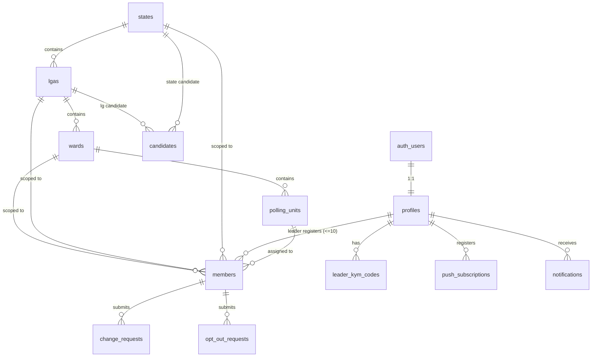

# Data Model

The authoritative schema is defined by the SQL migrations in `supabase/migrations/`. This
document is the human-readable companion: the entities, relationships, and the rules the
schema must enforce. Keep it in sync when migrations change.

> Some fields are marked **TBD** pending client input (membership-number format, login
> credential, card design). These are tracked as [open decisions](../project/roadmap.md#open-questions).

---

## Entity–relationship diagram

---

## Reference / geography

| Table | Key columns | Notes |
|-------|-------------|-------|
| `states` | `id`, `name`, `code`, `is_active` | **37**: 36 states + FCT (confirmed). `code` is a 2-letter id used in membership numbers. `is_active` true once a State Admin is assigned. Seeded in `supabase/migrations/0002_seed_states.sql`. |
| `lgas` | `id`, `state_id`, `name` | Local Government Areas. |
| `wards` | `id`, `lga_id`, `name` | Electoral ward. |
| `polling_units` | `id`, `ward_id`, `name`, `code?` | **Smallest electoral unit** — a ward has many. "Unit" in the role hierarchy = **polling unit** (CR-0002). Members are assigned here for agent allocation. |

> Correction (CR-0002): the earlier `units` (2+ wards) / `unit_wards` model was wrong. Hierarchy is
> **State → LGA → Ward → Polling Unit**; a corrective migration replaces `units`/`unit_wards` with
> `polling_units` (see [supabase/README.md](../../supabase/README.md)).

## Identity & roles

| Table | Key columns | Notes |
|-------|-------------|-------|
| `profiles` | `id` (=`auth.users.id`), `role`, `state_id?`, `lga_id?`, `ward_id?`, `polling_unit_id?`, `full_name`, `status` | 1:1 with Supabase `auth.users`. Scope FKs non-null only at the relevant level (`ward_admin` scopes to a ward; `unit_coordinator` to a polling unit). |
| `members` | `id`, `membership_number` (unique, immutable), `registered_by` (leader), `state_id`, `lga_id`, `ward_id`, `polling_unit_id`, `full_name`, `date_of_birth`, `passport_photo_url`, `nin` (unique), `vin`, `account_number`, `account_name`, `bank_name`, `status` | The membership record (fields per CR-0002). **NIN/VIN/bank are sensitive PII** — strict RLS, never exposed beyond the caller's scope. `L.G / Ward / Polling Unit` auto-loaded from geography. |

**`role` enum:** `national_admin` · `state_admin` · `lg_admin` · `ward_admin` · `unit_coordinator` · `leader` · `member`.

> **Leadership model (CR-0003).** Every role **except `member` is a leader**, at a different level.
> The chain is **National → State → LG → Ward → Polling Unit → Leader → Member**: `national_admin`
> is the apex (#1); `unit_coordinator` (polling unit) coordinates the grassroots `leader`s beneath
> it; each `leader` serves **≤10 members**. `ward_admin` was added here between `lg_admin` and
> `unit_coordinator`, mirroring the electoral geography (State → LGA → Ward → Polling Unit).

**`member.status` enum:** `active` · `frozen` · `deleted`.

### Invariants (enforced by DB constraints + Server Actions)

1. `membership_number` is **unique** and **never updated** after insert. **Format (confirmed):**
   `TWM-<STATE>-<LGA>-<seq>` (e.g. `TWM-LA-IKJ-000123`) — sequence is per-LGA, zero-padded.
2. A `leader` has **≤ 10** `active` members (`registered_by` count check).
3. **No duplicate registration** — key = **NIN** (CR-0002). Enforced by a **UNIQUE constraint on
   `members.nin`** (plus a soft-warn at registration for a friendly message).
4. **Age ≥ 18** at registration — DB check on `date_of_birth` (anyone under 18 cannot be registered).
4. A member's `state_id`/`lga_id`/`ward_id` are consistent (ward ∈ lga ∈ state).
5. Members cannot self-register: inserts into `members` come only from a leader's Server Action.

## Workflows

| Table | Key columns | Notes |
|-------|-------------|-------|
| `change_requests` | `id`, `member_id`, `field`, `new_value`, `reason`, `status`, `reviewed_by`, `reviewed_at` | Non-photo profile edits. Approved/rejected by State Admin. |
| `opt_out_requests` | `id`, `member_id`, `reason`, `status` (`requested`/`frozen`/`deleted`/`reactivated`) | Freeze → leader retention → delete or reactivate. |
| `leader_kym_codes` | `id`, `leader_id`, `code` (unique) | Leader-to-leader verification (KYM). |

## Movement content

| Table | Key columns | Notes |
|-------|-------------|-------|
| `candidates` | `id`, `level` (`presidential`/`state`/`lg`), `state_id?`, `lga_id?`, `uploaded_by`, details | Members see the candidate for their L.G + the presidential candidate. |
| `notifications` | `id`, `audience` (scope), `title`, `body`, `type`, `created_at` | Voting reminders + major updates; delivered in-app and via Web Push. |
| `push_subscriptions` | `id`, `user_id`, `endpoint`, `keys` | Web Push endpoints per user. |

---

## Row-Level Security summary

Every table has RLS enabled. Representative policies (full SQL in migrations):

| Actor | Can read | Can write |
|-------|----------|-----------|
| National admin | all members, all admins, all states | states activation, admin accounts, presidential candidate |
| State admin | members in their `state_id` | approve/reject change requests in state; state candidates |
| L.G admin | members in their `lga_id` (all wards within) | scoped oversight |
| Ward admin | members in their `ward_id` (all polling units within) | scoped oversight |
| Unit coordinator | members in their `polling_unit_id` | scoped oversight of the leaders beneath |
| Leader | their own ≤10 members | register/edit their members; download their cards |
| Member | their own record only | profile photo; submit change/opt-out requests |

See [security-model.md](security-model.md) and
[ADR-0005](decisions/0005-rls-as-authorization-boundary.md) for the reasoning.

## Auditability

Admin actions (activation, edits, approvals, deletions) are recorded for the activity logs
referenced in the app spec. An `audit_log` table is planned in a later phase.
