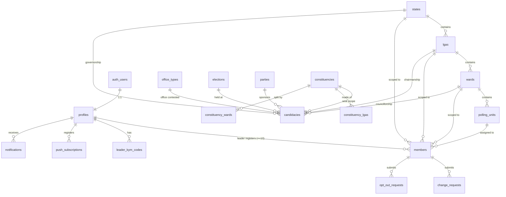

# Data Model

The authoritative schema is defined by the SQL migrations in `supabase/migrations/`. This
document is the human-readable companion: the entities, relationships, and the rules the
schema must enforce. Keep it in sync when migrations change.

> Some fields are marked **TBD** pending client input (membership-number format, login
> credential, card design). These are tracked as [open decisions](../project/roadmap.md#open-questions).

---

## Entity–relationship diagram

```mermaid
erDiagram
    states ||--o{ lgas : contains
    lgas ||--o{ wards : contains
    wards ||--o{ polling_units : contains
    polling_units ||--o{ members : "assigned to"

    auth_users ||--|| profiles : "1:1"
    profiles ||--o{ members : "leader registers (<=10)"
    states ||--o{ members : "scoped to"
    lgas ||--o{ members : "scoped to"
    wards ||--o{ members : "scoped to"

    members ||--o{ change_requests : submits
    members ||--o{ opt_out_requests : submits
    profiles ||--o{ leader_kym_codes : has
    profiles ||--o{ push_subscriptions : registers

    office_types ||--o{ candidacies : "office contested"
    elections ||--o{ candidacies : "held at"
    parties ||--o{ candidacies : "sponsors"
    constituencies ||--o{ candidacies : "seat scope"
    constituencies ||--o{ constituency_lgas : "made of"
    constituencies ||--o{ constituency_wards : "split by"
    states ||--o{ candidacies : "governorship"
    lgas ||--o{ candidacies : "chairmanship"
    wards ||--o{ candidacies : "councillorship"
    profiles ||--o{ notifications : receives
```

---

## Reference / geography

| Table | Key columns | Notes |
|-------|-------------|-------|
| `states` | `id`, `name`, `code`, `is_active` | **37**: 36 states + FCT (confirmed). `code` is a 2-letter id used in membership numbers. `is_active` true once a State Admin is assigned. Seeded in `supabase/migrations/0002_seed_states.sql`. |
| `lgas` | `id`, `state_id`, `name` | Local Government Areas. |
| `wards` | `id`, `lga_id`, `name` | Electoral ward. |
| `polling_units` | `id`, `ward_id`, `name`, `code?` | **Smallest electoral unit** — a ward has many. "Unit" in the role hierarchy = **polling unit** (CR-0002). Members are assigned here for agent allocation. |

> Correction (CR-0002): the earlier `units` (2+ wards) / `unit_wards` model was wrong. Hierarchy is
> **State → LGA → Ward → Polling Unit**. Migration `0003_polling_units.sql` dropped `units`/`unit_wards`
> and added `polling_units` (child of ward). Identity + hierarchical RLS land in `0004`–`0006`
> (T-001b), verified by `supabase/tests/rls_test.sql`.

## Identity & roles

| Table | Key columns | Notes |
|-------|-------------|-------|
| `profiles` | `id` (=`auth.users.id`), `role`, `state_id?`, `lga_id?`, `ward_id?`, `polling_unit_id?`, `full_name`, `status` | 1:1 with Supabase `auth.users`. Scope FKs non-null only at the relevant level (`ward_admin` scopes to a ward; `unit_coordinator` to a polling unit). |
| `members` | `id`, `membership_number` (unique, immutable), `registered_by` (leader), `state_id`, `lga_id`, `ward_id`, `polling_unit_id`, `full_name`, `date_of_birth`, `passport_photo_url`, `nin` (unique), `vin`, `account_number`, `account_name`, `bank_name`, `status` | The membership record (fields per CR-0002). **NIN/VIN/bank are sensitive PII** — strict RLS, never exposed beyond the caller's scope. `L.G / Ward / Polling Unit` auto-loaded from geography. |

**`role` enum:** `national_admin` · `state_admin` · `lg_admin` · `ward_admin` · `unit_coordinator` · `leader` · `member`.

> **Leadership model (CR-0003).** Every role **except `member` is a leader**, at a different level.
> The chain is **National → State → LG → Ward → Polling Unit → Leader → Member**: `national_admin`
> is the apex (#1); `unit_coordinator` (polling unit) coordinates the grassroots `leader`s beneath
> it; each `leader` serves their own members. `ward_admin` was added here between `lg_admin` and
> `unit_coordinator`, mirroring the electoral geography (State → LGA → Ward → Polling Unit).

**`member.status` enum:** `active` · `frozen` · `deleted`.

### Invariants (enforced by DB constraints + Server Actions)

1. `membership_number` is **unique** and **never updated** after insert. **Format (confirmed):**
   `TWM-<STATE>-<LGA>-<seq>` (e.g. `TWM-LA-IKJ-000123`) — sequence is per-LGA, zero-padded.
2. **There is no limit on how many members a `leader` may hold.** Ten was a hard cap until
   CR-0009 §3.4; migration `0023` dropped `enforce_leader_capacity()` and its trigger, turning ten
   into a **milestone** celebrated on the leader's dashboard. `registered_by` still attributes every
   member to whoever registered them, and every count in the product keys on it.
3. **No duplicate registration** — key = **NIN** (CR-0002). Enforced by a **UNIQUE constraint on
   `members.nin`** (plus a soft-warn at registration for a friendly message).
4. **Voter identity is unique across the whole system** (CR-0009 §3.1, ADR-0015). The VIN lives in
   `public.voter_ids` keyed by the number itself; `members.vin_id` and `profiles.vin_id` are
   nullable, uniquely-indexed references to it. That makes system-wide uniqueness a **primary key**
   rather than a cross-table trigger, and lets one person who is both a member and a leader point
   both rows at the same entry. Required by partial CHECK (not `NOT NULL`, which would break the
   PII erasure in `0009`), and normalised server-side by `lib/vin.ts` before any write.
4. **Age ≥ 18** at registration — DB check on `date_of_birth` (anyone under 18 cannot be registered).
4. A member's `state_id`/`lga_id`/`ward_id` are consistent (ward ∈ lga ∈ state).
5. Members cannot self-register: inserts into `members` come only from a leader's Server Action.

## Workflows

| Table | Key columns | Notes |
|-------|-------------|-------|
| `change_requests` | `id`, `member_id`, `field`, `new_value`, `reason`, `status`, `reviewed_by`, `reviewed_at` | Non-photo profile edits. Approved/rejected by State Admin. |
| `opt_out_requests` | `id`, `member_id`, `reason`, `status` (`requested`/`frozen`/`deleted`/`reactivated`), `retention_until`, `requested_at`, `resolved_at`, `resolved_by` | Freeze → leader retention → delete or reactivate (T-008, migration `0009`). Member freeze sets `status='frozen'`; delete allowed only after `retention_until` (default **30 days**, roadmap Q10). Member lifecycle columns live on `members` (`frozen_at`, `deleted_at`); permanent delete erases PII (`nin`/`date_of_birth` made nullable) and keeps the membership number as a tombstone. State machine `active→frozen→active\|deleted` is enforced by a DB trigger. |
| `leader_kym_codes` | `id`, `leader_id`, `code` (unique) | Leader-to-leader verification (KYM). |

## Movement content

| Table | Key columns | Notes |
|-------|-------------|-------|
| `notifications` | `id`, `audience` (scope), `title`, `body`, `type`, `created_at` | Voting reminders + major updates; delivered in-app and via Web Push. |
| `push_subscriptions` | `id`, `user_id`, `endpoint`, `keys` | Web Push endpoints per user. |

## Elective offices (CR-0007, ADR-0013)

Migrations `0016`–`0018`. This is **not a voting system**: nothing casts or counts a vote. It
exists so members can see the candidates that have been uploaded for their area. The offices are
**data, not an enum**, so the national admin can add and correct them without a deploy.

| Table | Key columns | Notes |
|-------|-------------|-------|
| `office_types` | `key`, `title`, `tier`, **`constituency_kind`**, `has_running_mate`, `running_mate_title`, `sort_order`, `is_active` | The seven elective offices. `constituency_kind` (`nation`/`state`/`lga`/`ward`/`senatorial_district`/`federal_constituency`/`state_constituency`) declares what geography a seat is elected from, and everything else branches on it. `has_running_mate` records that President/VP, Governor/Deputy and Chairman/Vice are one joint ticket. |
| `parties` | `name`, `acronym`, `color?`, `logo_url?`, `is_active` | Seeded with INEC's 21 registered parties as at April 2026. Verify before each cycle. |
| `elections` | `name`, `election_date`, `scope` (`national`/`state`), `state_id?` | Dates move, so they are data. Seeded with the 2027 general (16 Jan + 6 Feb) and Osun 2026. |
| `election_office_types` | `election_id`, `office_type_id` | Which offices a given election fills. |
| `constituencies` | `kind`, `state_id`, `name`, `code?` | The INEC overlay: senatorial districts, federal and state constituencies. Every constituency lies in exactly one state. |
| `constituency_lgas` / `constituency_wards` | `constituency_id`, `kind`, `lga_id`/`ward_id` | Membership. A **ward row overrides its LGA's row** for the same kind, so ward-level data is only needed where an LGA is split. `kind` is filled by trigger under a composite FK, making "one constituency of each kind per ward" a real constraint. |
| `candidacies` | `election_id`, `office_type_id`, one of `state_id`/`lga_id`/`ward_id`/`constituency_id`, `full_name`, `running_mate_name?`, `party_id?`, `photo_url?`, `slogan?`, `is_endorsed`, `is_published` | Replaces `candidates`. **Multiple candidacies per race are allowed.** Exactly one scope column is filled, decided by the office and enforced by `private.enforce_candidacy_scope()`. |

**The constituency overlay does not nest in the geography tree.** A federal constituency is built
from whole wards and may split a populous LGA (Lagos: 20 LGAs, 24 federal constituencies). It
therefore cannot be derived from `ward.lga_id`. See
[nigeria-elective-offices.md](../project/nigeria-elective-offices.md#32-the-overlay-that-does-not-nest-read-this-before-modelling).

> **Constituency coverage (T-031).** All **1,459** constituencies are imported from INEC's own
> workbook (109 senatorial, 360 federal, 990 state). **Senatorial LGA membership exists for 22 of
> 37 states**, so 5,017 wards resolve to a senatorial district; federal and state constituencies
> have no membership yet, so those two races resolve for nobody and the UI says so. Provenance,
> verification and what remains: [docs/project/data/constituencies](../project/data/constituencies/README.md)
> and **T-031b**.

### Functions

| Function | Purpose |
|---|---|
| `public.candidacies_for_geography(state?, lga?, ward?)` | Every race that applies to a place. Not `security definer`, so RLS still hides unpublished rows from members. |
| `public.candidacies_i_manage()` | The races the caller may edit, so the admin UI and the write policies cannot drift. |
| `public.can_manage_candidacy(office, …)` | Pre-flight for the admin form. |
| `public.ward_constituencies` (view) | Ward to constituency resolution, ward rows overriding LGA rows. |

---

## Row-Level Security summary

Every table has RLS enabled. Representative policies (full SQL in migrations):

| Actor | Can read | Can write |
|-------|----------|-----------|
| National admin | all members, all admins, all states | states activation, admin accounts, presidential candidate |
| State admin | members in their `state_id` | approve/reject change requests in state; state candidates |
| L.G admin | members in their `lga_id` (all wards within) | scoped oversight |
| Ward admin | members in their `ward_id` (all polling units within) | scoped oversight |
| Unit coordinator | members in their `polling_unit_id` | scoped oversight of the leaders beneath |
| Leader | their own registered members | register/edit their members; download their cards |
| Member | their own record only | profile photo; submit change/opt-out requests |

See [security-model.md](security-model.md) and
[ADR-0005](decisions/0005-rls-as-authorization-boundary.md) for the reasoning.

## Auditability

Admin actions (activation, edits, approvals, deletions) are recorded for the activity logs
referenced in the app spec. An `audit_log` table is planned in a later phase.
