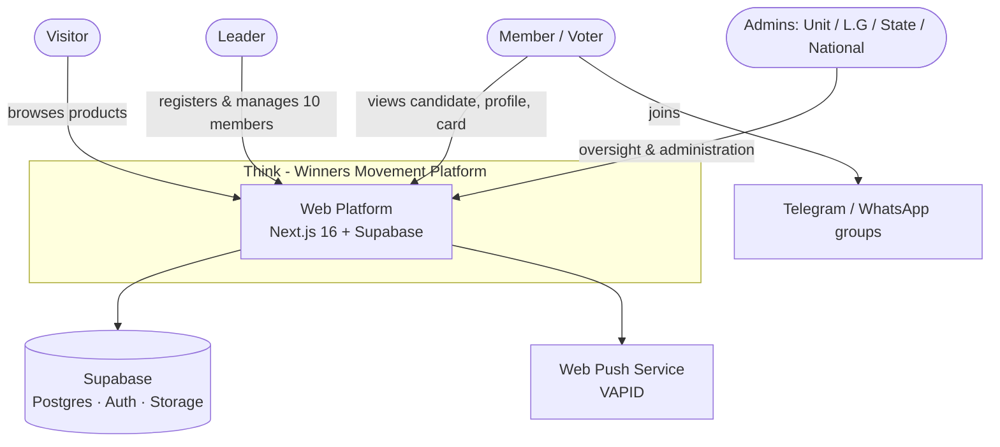
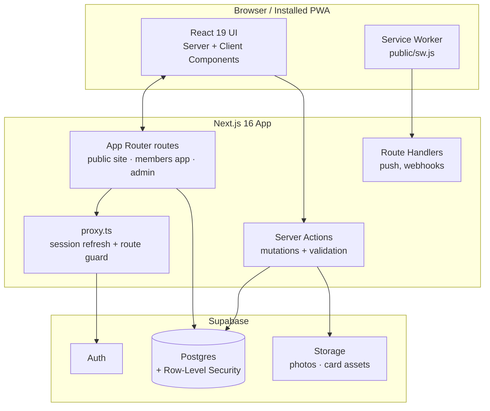
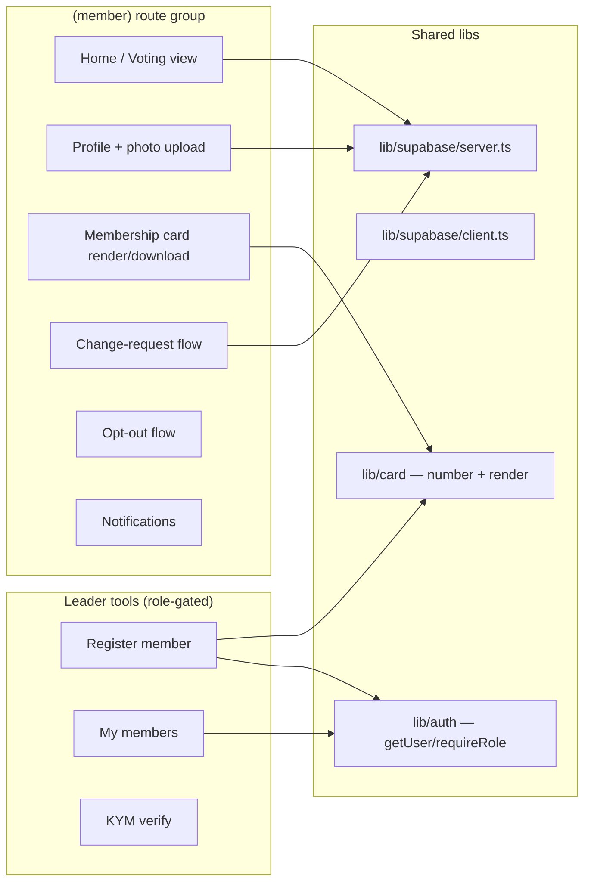

# Architecture Overview

This document describes the system using the [C4 model](https://c4model.com/) — a layered
way to describe software architecture at increasing levels of detail (Context → Container →
Component). Diagrams are expressed in Mermaid so they render on GitHub and stay in version control.

> Status: living document. Update it in the same PR as any architecturally significant change.

---

## Level 1 — System Context

Who uses the platform and what it talks to.

**The five+ user groups** and their scope are defined by the role hierarchy — see
[security-model.md](security-model.md).

---

## Level 2 — Containers

The deployable/runtime pieces. This is a single Next.js application (a "modular monolith")
backed by Supabase — deliberately simple for Phase 1 (see
[ADR-0002](decisions/0002-nextjs-16-app-router.md), [ADR-0003](decisions/0003-supabase-as-backend.md)).

### Container responsibilities

| Container | Responsibility |
|-----------|----------------|
| **App Router routes** | Server-first rendering; route groups per surface (`(public)`, `(member)`, `(admin)`) |
| **Server Actions** | All mutations; Zod validation; call Supabase with the user's session (RLS applies) |
| **`proxy.ts`** | Refreshes Supabase session on each request, redirects unauthenticated users (the Next 16 rename of `middleware.ts`) |
| **Route Handlers** | Non-form endpoints: push subscription, future webhooks |
| **Service Worker** | Receives Web Push, shows notifications, enables installability |
| **Postgres + RLS** | Data + the authoritative authorization boundary |
| **Auth** | Identity & sessions (cookie-based via `@supabase/ssr`) |
| **Storage** | Profile photos, membership-card template & generated assets |

---

## Level 3 — Components (Members' app, Phase 1)

---

## Key architectural characteristics

| Concern | Approach |
|---------|----------|
| **Rendering** | Server Components by default; Client Components only for interactivity (per Next 16) |
| **Authorization** | RLS in Postgres is the source of truth; UI + Server Actions mirror it (defense in depth) |
| **Mutations** | Server Actions with Zod validation — no unvalidated writes |
| **Async request APIs** | `params`, `searchParams`, `cookies()`, `headers()` are awaited (Next 16 requirement) |
| **State activation** | A state is inactive until National assigns an admin |
| **Offline / installability** | PWA manifest + service worker |
| **Deployment** | Vercel (Next-native) or any Node ≥ 20.9 host; Supabase managed |

## Evolution notes

- Phase 1 keeps everything in one Next.js app. If admin surfaces grow heavy, they can be
  split into a separate route group or app without changing the data layer.
- Any deviation from the above is recorded as a new [ADR](decisions/).
