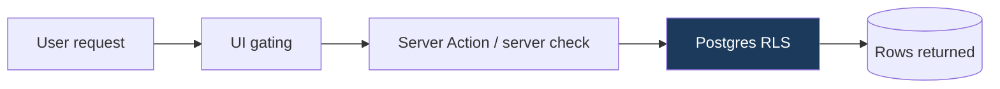

# Security & Authorization Model

The platform's defining characteristic is a **hierarchical authorization model** over
**personal data**. This document defines the roles, the trust boundaries, and the threat
model. The reporting process lives in [SECURITY.md](../../SECURITY.md).

---

## Roles & scope

| Role | Scope | Core powers |
|------|-------|-------------|
| **National Admin** | All 37 (36 states + FCT) | Activate states, create/manage State Admins, upload Presidential candidate, full visibility |
| **State Admin** | One assigned state | Oversee members & activities, approve/reject change requests, upload state candidates |
| **L.G Admin** | One Local Government | Oversee the wards (and everything below) in the L.G |
| **Ward Admin** | One ward | Oversee the polling units (and the leaders/members below) in the ward |
| **Unit Coordinator** | One polling unit | Coordinate the grassroots leaders in the polling unit |
| **Leader** | Their ≤10 registered members | Register members, edit their info, download their cards, KYM |
| **Member** | Self | View own profile & candidate, request changes/opt-out |
| **Visitor** | Public site | Read & enquire only |

> **Every role except Member is a leader** (CR-0003) — the table above is one chain of leadership,
> narrowing scope at each step from the National Admin (#1) down to a single Leader with ten members.

Authority strictly narrows as you go down the hierarchy. Scope is stored on `profiles`
(`state_id` / `lga_id` / `ward_id` / `polling_unit_id`) and enforced in the database.

---

## Authorization: defense in depth

Three layers, with the **database as the source of truth**:

1. **Row-Level Security (RLS) in Postgres** — the authoritative boundary. Even a bug in the
   app cannot return rows a user isn't entitled to. See
   [ADR-0005](decisions/0005-rls-as-authorization-boundary.md).
2. **Server Actions / server checks** — `requireRole()` / `getUser()` gate mutations and
   sensitive reads before hitting the DB; validate input with Zod.
3. **UI gating** — hide controls a user can't use. **Convenience only, never a security control.**

## Authentication & sessions

- Supabase Auth issues sessions stored in cookies via `@supabase/ssr`.
- `proxy.ts` refreshes the session on each request and redirects unauthenticated users away
  from protected route groups.
- Members do **not** self-register — accounts are created by Leaders. There is no public
  sign-up path for members.

## Secrets & keys

| Secret | Exposure | Rule |
|--------|----------|------|
| `NEXT_PUBLIC_SUPABASE_ANON_KEY` | client OK | Constrained by RLS. |
| `SUPABASE_SERVICE_ROLE_KEY` | **server only** | Bypasses RLS — never send to client; use sparingly. |
| `VAPID_PRIVATE_KEY` | **server only** | Signs push messages. |
| `NEXT_PUBLIC_VAPID_PUBLIC_KEY` | client OK | Public by design. |

Secrets live in `.env.local` (git-ignored). `.env.example` documents required vars.

## Security headers

Enforced in `next.config.ts` per the Next 16 PWA guide:

- `X-Content-Type-Options: nosniff`
- `X-Frame-Options: DENY`
- `Referrer-Policy: strict-origin-when-cross-origin`
- Strict CSP + `no-store` for `/sw.js`.

## Threat model (STRIDE, abbreviated)

| Threat | Example | Mitigation |
|--------|---------|-----------|
| **Spoofing** | Fake login / session theft | Supabase Auth, httpOnly cookies, session refresh in `proxy.ts` |
| **Tampering** | Editing another member's record | RLS scoping + server-side validation |
| **Repudiation** | Admin denies an action | Activity/audit logs of admin actions |
| **Information disclosure** | Leader reading other leaders' members | RLS row scoping; least-privilege reads |
| **Denial of service** | Abuse of registration/push | Rate limiting (planned), input caps |
| **Elevation of privilege** | Member acting as admin | Role checks in DB **and** server; never trust the client |

## Privacy

- Collect only what membership administration requires.
- Opt-out leads to permanent deletion after the retention step.
- Membership numbers are immutable identifiers, not secrets, but treated as PII in context.

## Key security invariants (must always hold)

1. No query path returns rows outside the caller's scope (guaranteed by RLS).
2. The service-role key never reaches the browser.
3. Every mutation is validated server-side before the DB call.
4. Membership numbers cannot be changed after issue.
5. Duplicate registrations are rejected at the database level.
