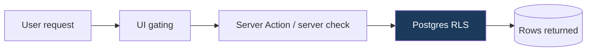

# Security & Authorization Model

The platform's defining characteristic is a **hierarchical authorization model** over
**personal data**. This document defines the roles, the trust boundaries, and the threat
model. The reporting process lives in [SECURITY.md](../../SECURITY.md).

---

## Roles & scope

| Role | Scope | Core powers |
|------|-------|-------------|
| **National Admin** | All 37 (36 states + FCT) | Activate states, create/manage State Admins, own the elective-office catalogue, manage any candidacy, full visibility |
| **State Admin** | One assigned state | Oversee members & activities, approve/reject change requests, manage any candidacy inside their state |
| **L.G Admin** | One Local Government | Oversee the wards (and everything below) in the L.G; manage chairman + councillor candidacies in it |
| **Ward Admin** | One ward | Oversee the polling units (and the leaders/members below) in the ward; manage its councillor candidacy |
| **Unit Coordinator** | One polling unit | Coordinate the grassroots leaders in the polling unit |
| **Leader** | Their own registered members | Register members, edit their info, download their cards, KYM |
| **Member** | Self | View own profile, browse candidates in any area, request changes/opt-out |
| **Visitor** | Public site | Read & enquire only |

> **Every role except Member is a leader** (CR-0003) — the table above is one chain of leadership,
> narrowing scope at each step from the National Admin (#1) down to a single Leader with their own members.

Authority strictly narrows as you go down the hierarchy. Scope is stored on `profiles`
(`state_id` / `lga_id` / `ward_id` / `polling_unit_id`) and enforced in the database.

### The National Admin is unscoped (CR-0007)

**Their scope fields are all NULL**, which the `profiles_scope_matches_role` check requires, and
every scope predicate (`member_in_scope`, `profile_in_scope`, `candidacy_in_scope`) short-circuits
to `true` for them. So they see and change anything at any level: any state's members, any tier of
the leadership chain, any candidacy, the whole reference catalogue. Nothing special-cases them;
"no scope set" simply means "nothing constrains the comparison".

Concretely, they may **create any role below them at any geography** (not just a State Admin) and
**manage every tier on the Team page** (not just the tier directly below).

They may also **register a member into any polling unit in the country** (migration `0019`), either
attributing the member to a leader who sits in that polling unit, or holding the member themselves
where no leader exists yet.

That once required scoping the **≤10-members cap** to leaders, so the national admin was not
capped at ten by a rule that never described them. **The cap is gone entirely** as of CR-0009 §3.4:
migration `0023` dropped `enforce_leader_capacity()` and its trigger, and ten is now a milestone the
dashboard celebrates rather than a ceiling the database enforces. Attributing a member to a leader
still counts against that leader, which is the behaviour worth keeping.

Note for reviewers: **no authorization rule ever depended on the cap.** It was a business rule, so
removing it changes what a leader may *do*, never what they may *see*.

One limit remains, and it is a capability limit rather than a scope limit:

- **No national admin may create or edit another national admin.** The rank rule in
  `profiles_insert` / `profiles_update` requires the target to rank strictly lower. This is
  [ADR-0012](decisions/0012-national-admin-bootstrap.md) by design: if the highest privilege could
  mint itself, one compromised session becomes permanent, unbounded access, with no higher
  authority left to revoke it. Additional national admins stay a deliberate DBA action.

Two workflow gates also still apply to everyone, including them, because they are product rules
rather than scope: a state must be **activated** before members can be registered in it (T-019),
and a member must be **18 or older**.

---

## Authorization: defense in depth

Three layers, with the **database as the source of truth**:

1. **Row-Level Security (RLS) in Postgres** — the authoritative boundary. Even a bug in the
   app cannot return rows a user isn't entitled to. See
   [ADR-0005](decisions/0005-rls-as-authorization-boundary.md).
2. **Server Actions / server checks** — `requireRole()` / `getUser()` gate mutations and
   sensitive reads before hitting the DB; validate input with Zod.
3. **UI gating** — hide controls a user can't use. **Convenience only, never a security control.**

```mermaid
flowchart LR
    u[User request] --> ui[UI gating]
    ui --> sa[Server Action / server check]
    sa --> rls[Postgres RLS]
    rls --> data[(Rows returned)]
    style rls fill:#1B3A5C,color:#fff
```

### Candidacy writes: containment, not a permission table

Elective-office data (CR-0007, [ADR-0013](decisions/0013-elective-office-catalogue.md)) uses a
different scope shape from members and profiles: a candidacy's constituency can span many LGAs, so
the existing `member_in_scope` style of single-column equality does not apply.

The rule is **geographic containment**: an admin may write a candidacy if and only if its
constituency lies inside their own scope. `private.candidacy_in_scope()` resolves the candidacy
down to (state, LGA, ward) and compares against the caller's profile. No role-to-office mapping
table exists, so nothing can drift out of sync with the geography.

Consequences worth knowing:

- A **national office (President) is national-admin only**: containment returns false for everyone else.
- An **LG admin cannot touch a federal or senatorial constituency**, because it is normally larger
  than their LGA. They only get it if the constituency maps to exactly one LGA and is not ward-split.
- **Catalogue tables** (offices, parties, elections, constituencies) are world-readable and
  **national-admin-write-only**, via their own policies.
- **Reads are deliberately open**: any signed-in user may read `is_published` candidacies in any
  geography, because members were asked to be able to look at other areas. Unpublished drafts are
  visible only to admins who could edit them.
- Candidacy writes go through the **caller's** Supabase client, not the service role, so RLS is the
  actual gate. The service role touches only the photo object in storage.

## Authentication & sessions

- Supabase Auth issues sessions stored in cookies via `@supabase/ssr`.
- `proxy.ts` refreshes the session on each request and redirects unauthenticated users away
  from protected route groups.
- Members do **not** self-register — accounts are created by Leaders. There is no public
  sign-up path for members.

## Secrets & keys

| Secret | Exposure | Rule |
|--------|----------|------|
| `NEXT_PUBLIC_SUPABASE_ANON_KEY` | client OK | Constrained by RLS. |
| `SUPABASE_SERVICE_ROLE_KEY` | **server only** | Bypasses RLS — never send to client; use sparingly. |
| `VAPID_PRIVATE_KEY` | **server only** | Signs push messages. |
| `NEXT_PUBLIC_VAPID_PUBLIC_KEY` | client OK | Public by design. |

Secrets live in `.env.local` (git-ignored). `.env.example` documents required vars.

## Security headers

Enforced in `next.config.ts` per the Next 16 PWA guide:

- `X-Content-Type-Options: nosniff`
- `X-Frame-Options: DENY`
- `Referrer-Policy: strict-origin-when-cross-origin`
- Strict CSP + `no-store` for `/sw.js`.

## Threat model (STRIDE, abbreviated)

| Threat | Example | Mitigation |
|--------|---------|-----------|
| **Spoofing** | Fake login / session theft | Supabase Auth, httpOnly cookies, session refresh in `proxy.ts` |
| **Tampering** | Editing another member's record | RLS scoping + server-side validation |
| **Repudiation** | Admin denies an action | Activity/audit logs of admin actions |
| **Information disclosure** | Leader reading other leaders' members | RLS row scoping; least-privilege reads |
| **Denial of service** | Abuse of registration/push | Rate limiting (planned), input caps |
| **Elevation of privilege** | Member acting as admin | Role checks in DB **and** server; never trust the client |

## Privacy

- Collect only what membership administration requires.
- Opt-out leads to permanent deletion after the retention step.
- Membership numbers are immutable identifiers, not secrets, but treated as PII in context.

## Key security invariants (must always hold)

1. No query path returns rows outside the caller's scope (guaranteed by RLS).
2. The service-role key never reaches the browser.
3. Every mutation is validated server-side before the DB call.
4. Membership numbers cannot be changed after issue.
5. Duplicate registrations are rejected at the database level.
