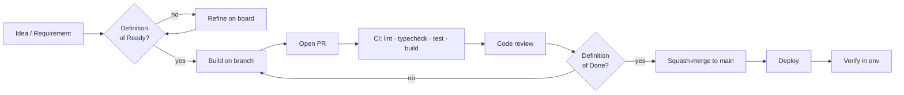

# Software Development Lifecycle (SDLC)

How work flows from an idea to running in production. The goal is a lightweight, repeatable
process that keeps `main` always releasable and every change traceable.

## Phases

### 1. Discovery & specification
Requirements come from the project brief (`docs/Think-winner movement.docx`) and the
[roadmap](../project/roadmap.md). Anything ambiguous becomes an **open question** on the
roadmap and is resolved before the dependent work is marked Ready.

### 2. Planning
Work is broken into tasks on the [task board](../project/task-board.md). Significant technical
choices get an [ADR](../architecture/decisions/). A task enters **Ready** only when it meets
the [Definition of Ready](definition-of-done.md#definition-of-ready).

### 3. Implementation
Trunk-based development on a short-lived branch (see [git-workflow.md](git-workflow.md)),
following the [coding standards](coding-standards.md). Framework code is checked against the
Next 16 docs in `node_modules/next/dist/docs/`.

### 4. Verification
- Automated: lint, typecheck, tests, and a production build run in CI on every PR.
- Manual: exercise the affected flow end-to-end (drive the real app, not just tests).

### 5. Review
Every PR is reviewed against the [code review checklist](code-review.md) and must satisfy the
[Definition of Done](definition-of-done.md#definition-of-done).

### 6. Release & deploy
Squash-merge to `main`, which is always releasable. Deploys are continuous from `main`
(Vercel or equivalent). Versioned releases update [CHANGELOG.md](../../CHANGELOG.md) using
SemVer, derived from Conventional Commit history.

### 7. Operate & learn
Monitor errors and behavior in the deployed environment. Bugs re-enter at phase 1. Notable
incidents produce a short write-up and, if a decision changes, a new ADR.

## Environments

| Environment | Purpose | Data | Deploy trigger |
|-------------|---------|------|----------------|
| **Local** | Development | Local/dev Supabase project | Manual (`npm run dev`) |
| **Preview** | Per-PR review | Dev Supabase project | Automatic on PR (when remote/CI set up) |
| **Production** | Live users | Production Supabase project | Merge to `main` |

Each environment has its own Supabase project and its own secrets. Secrets are never shared
across environments and never committed.

## Roles in the process (small-team reality)

Even solo, we play the roles explicitly to build the habit: **author** (writes code + tests +
docs), **reviewer** (checks against the checklist), **owner** (accountable per
[CODEOWNERS](../../.github/CODEOWNERS)). Self-review still means running the full checklist
before merge.
