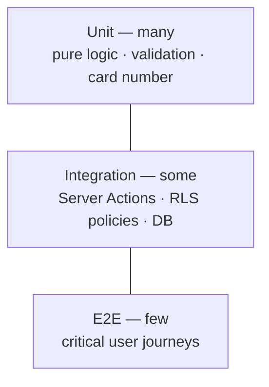

# Testing Strategy

We test to move fast with confidence, not to chase a coverage number. Tests are weighted by
value and cost using the **test pyramid**: many fast unit tests, fewer integration tests, a
small number of end-to-end tests for critical journeys.

## Layers

### Unit tests (many)
Pure, fast, no I/O. Target the logic most likely to be wrong in isolation:
- Zod validation schemas.
- Membership-number generation & format rules.
- Role/scope helpers (`requireRole`, scope derivation).
- Pure UI logic (formatters, small utilities).

### Integration tests (some)
Exercise units together against a real (or test-container) Supabase/Postgres:
- **Server Actions** end-to-end (validation → DB write → result).
- **RLS policies** — the highest-value integration tests here: assert that each role can read
  and write **only** its scope (a leader cannot see another leader's members; a state admin
  cannot touch another state). This directly protects the system's core invariant.
- Card generation writing to Storage.

### End-to-end tests (few)
Full browser journeys for the flows that would hurt most if broken:
- Leader registers a member → card generated → downloadable.
- Member logs in → sees the correct candidate for their L.G.
- Change-request → State Admin approval.
- Opt-out → freeze → delete/reactivate.

## Principles

- **Test behavior, not implementation.** Assert outcomes users/roles observe.
- **RLS is tested, not assumed.** Every policy has at least one allow and one deny test.
- **Deterministic.** No reliance on real time, network, or ordering; seed known data.
- **Fast feedback.** Unit + integration run in CI on every PR; E2E on the critical set.
- **A bug fix ships with a regression test** that fails before the fix and passes after.

## What must have tests

| Area | Minimum |
|------|---------|
| Validation schemas | Unit: valid + invalid cases |
| Membership number | Unit: format + uniqueness/immutability rules |
| RLS policies | Integration: allow + deny per role |
| Server Actions | Integration: happy path + validation failure + auth failure |
| Critical journeys | E2E: at least the flows listed above |
| Notifications | see below |

## Notifications & event-driven

The [notification system](../architecture/notifications.md) is event-driven, which has its own
failure modes (missed sends, duplicates, leaks, dead subscriptions). Test it at each layer:

- **Unit:** trigger logic (does event X produce notification N?), **dedup/idempotency** (a retried
  Server Action must not double-notify), audience/scope derivation, and notification **copy
  rendering** (right message, right deep link).
- **Integration:** the delivery pipeline end-to-end against the DB with a **mocked push service**
  (never hit real push in tests) — creating in-app records, enqueuing push, and **dead-subscription
  cleanup** on `410/404`. Critically, test **RLS**: a recipient can read only their own
  notifications, and only the owner can read/write their `push_subscriptions` (allow **and** deny).
- **E2E:** the **voting-reminder** journey (member receives N1 → taps → sees the right candidate)
  and the **push permission prompt** (in-context, not on first load).
- **Privacy assertion:** verify push payloads carry **no member PII** beyond name + link.

Scheduled/broadcast notifications (N1/N2) are tested by invoking the job directly with seeded data
— deterministic, no reliance on real time or a live scheduler.

## Tooling (in place)

- **Unit / component:** **Vitest** + **React Testing Library** (jsdom). Config in
  `vitest.config.ts`; matchers via `vitest.setup.ts`. Run with `npm run test` (watch: `npm run test:watch`).
- **E2E:** **Playwright** (`playwright.config.ts`, specs in `e2e/`). Run with `npm run test:e2e`;
  it starts the app itself on a **dedicated port (3100)** to avoid colliding with other local dev servers.
- **Typecheck:** `npm run typecheck` (`tsc --noEmit`).
- **CI:** `.github/workflows/ci.yml` runs lint → typecheck → unit → build, plus a Playwright job,
  on every PR. This is the "CI green" gate referenced in the git workflow.
- **DB for integration (later):** a disposable Supabase/Postgres instance — added with the
  Supabase foundation (T-001/T-002), when RLS/Server-Action integration tests come online.

Significant tooling changes get an ADR. Test files: `*.test.ts(x)` (Vitest) and `e2e/*.spec.ts`
(Playwright) — the two runners don't overlap.

## Manual verification

Automated tests don't replace driving the real app. Before merging non-trivial UI/flow
changes, exercise the affected path in the running app (the `verify` skill / `npm run dev`).

## Definition of enough

A change is adequately tested when its behavior and its meaningful failure modes are covered,
and a future refactor would be caught if it broke them — not when a percentage is hit.
