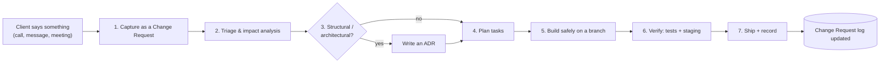

# Change Management

This is a **client project**. Requirements will change: the client will report new rules,
tweak flows, request UI changes, or reshape structures — often after features are already
built and possibly live. This document defines how we take a change from "the client said…"
to "shipped safely, nothing broken."

The golden rule: **every change is captured, assessed for impact, and integrated behind our
safety nets (branch → tests → review → verified deploy) — never applied ad hoc to `main`.**

---

## The flow



## 1. Capture — never work from memory

The moment the client communicates a change, record it as a **Change Request (CR)** using the
[template](change-requests/template.md), stored in [`change-requests/`](change-requests/) and
indexed in its [register](change-requests/README.md). A CR captures, in the client's own
words where possible:

- **What** they asked for and **why** (the underlying need, not just the surface request).
- **When** and **who** said it (traceability).
- Any examples, screenshots, or references they gave.

> Capturing first protects you: it turns a vague verbal request into a written, reviewable
> artifact, and prevents scope creep and "but I said…" disputes.

## 2. Triage & impact analysis

Before touching code, answer:

- **What surfaces/flows does this touch?** (members' app, admin, public site — and which roles.)
- **Does it change data?** New/renamed/removed columns or tables → a **migration** is needed
  (see [safe database changes](#safe-database-changes)).
- **Does it break existing behavior or data?** If yes, plan a backwards-compatible path.
- **Does it contradict the spec or another CR?** Flag it back to the client, don't silently guess.
- **Size:** trivial / small / large / needs-its-own-phase.

Record the analysis in the CR. This is where you catch "this innocent UI tweak actually
requires re-scoping every member" *before* it becomes a production incident.

## 3. Decide — does it need an ADR?

If the change alters **structure, architecture, security, or a significant decision**, write
an [ADR](../architecture/decisions/) (it may supersede an earlier one). Small UI/copy/flow
tweaks do not need an ADR — the CR is enough. Link the ADR from the CR.

## 4. Plan tasks

Break the CR into [task-board](task-board.md) tasks (`T-###`), each meeting the
[Definition of Ready](../engineering/definition-of-done.md#definition-of-ready). Link every
task back to its `CR-###`. Update the [roadmap](roadmap.md) if the change shifts phases.

## 5. Build safely — the safety techniques

The whole point of point (2) — "nothing is broken and is safely integrated." Techniques,
strongest first:

- **Isolate on a branch.** Never edit `main` directly. `main` stays releasable at all times.
- **Backwards-compatible database changes** — the *expand → migrate → contract* pattern:
  1. **Expand:** add the new column/table (nullable/defaulted); deploy. Old code still works.
  2. **Migrate:** backfill data; write to both old and new; deploy.
  3. **Contract:** switch reads to new; remove the old — only once nothing depends on it.
  Never rename/drop-and-recreate in a single destructive step against live data.
- **Feature flags / branch-by-abstraction** for risky flow or UI changes: build the new path
  behind a flag, verify, then flip it on. Lets you merge incrementally without exposing
  half-done work, and roll back by flipping the flag.
- **Preserve invariants.** Changes must not violate the system's hard rules (immutable
  membership numbers, no duplicate registration, role scoping). Re-check these in review.
- **Regression tests first.** For a change to existing behavior, add/adjust tests that encode
  the *new* expected behavior; ensure old guarantees still pass.
- **Small, reversible increments.** Prefer several small PRs over one big one.

## 6. Verify before the client sees it

- Automated: lint, typecheck, tests, build all green in CI.
- **Data migrations tested** on a copy, not first-run in production.
- Exercise the changed flow end-to-end in the **preview/staging** environment.
- Re-read the CR's acceptance criteria — does the result actually match what the client meant?

## 7. Ship & record

- Squash-merge → deploy from `main`.
- Update the CR status to **Shipped** with the release/commit reference.
- Update [CHANGELOG.md](../../CHANGELOG.md).
- Have a **rollback plan** noted in the CR (revert commit / flip flag / down-migration).
- Confirm with the client that it matches expectations; if not, that's a new CR, not a silent patch.

---

## Safe database changes (quick reference)

| Situation | Safe approach |
|-----------|---------------|
| Add a field | Add nullable/defaulted column; deploy; backfill; enforce constraints last. |
| Rename a field | Add new → write both → migrate reads → drop old (expand/contract). Never rename in place on live data. |
| Remove a field | Stop writing → confirm nothing reads it → drop in a later migration. |
| Change a rule/flow | Feature-flag the new behavior; verify; flip; remove old path later. |
| Anything destructive | Back up first; have a down-migration; deploy off-peak; monitor. |

Every schema change is a **versioned migration** in `supabase/migrations/` — never a manual
edit in the Supabase dashboard (dashboard edits aren't in git and can't be reviewed or rolled back).

## Traceability chain

Everything links, so any line of shipped code traces back to a client request:

```
Client request  →  CR-###  →  (ADR-#### if structural)  →  T-### task(s)  →  PR  →  release/CHANGELOG
```

## Handling "urgent" changes

Real urgency still goes through the flow — just compressed. A hotfix gets a CR (can be written
immediately after), a `fix/…` branch, tests where feasible, CI, and a `fix:` Conventional
Commit. Skipping the branch/tests to "save time" is how live client products break.
