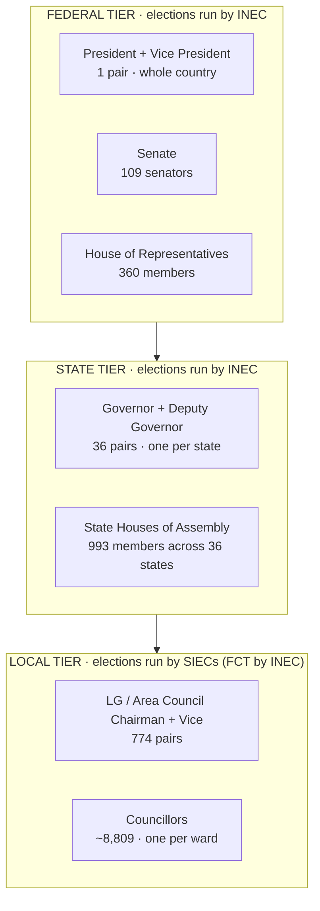
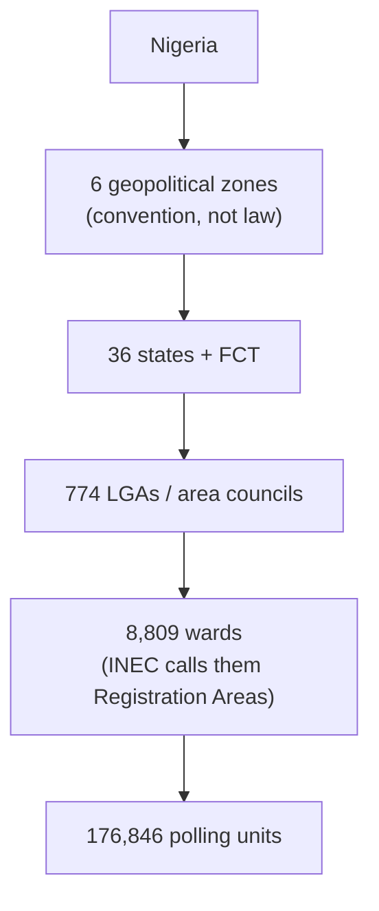
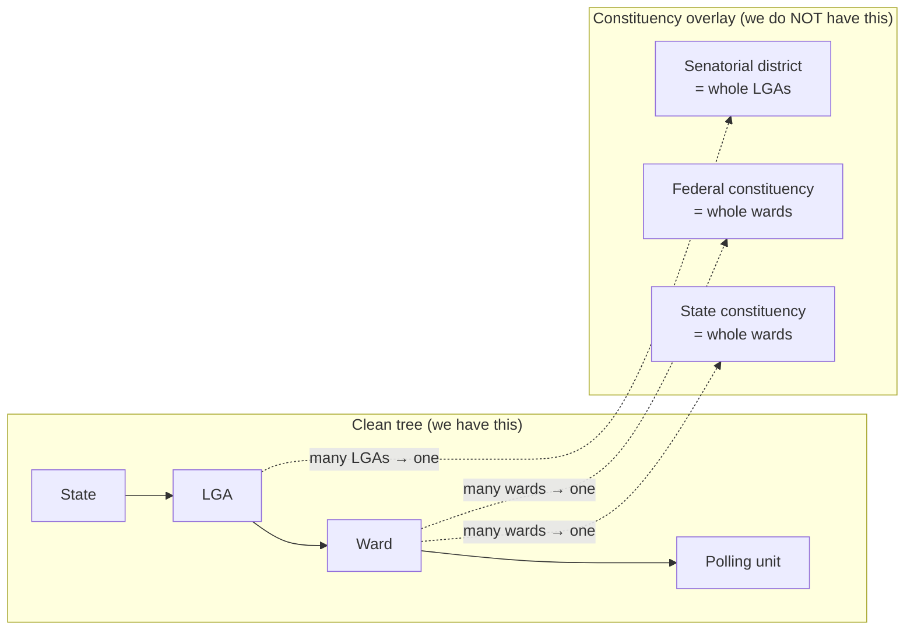

# Nigeria's elective offices and how they nest

Reference for **every position a Nigerian is elected into**, from President down to Councillor,
and how those positions relate to the electoral geography we already model
(`states → lgas → wards → polling_units`).

Written for T-007 follow-up: [`0010_candidates.sql`](../../supabase/migrations/0010_candidates.sql)
notes that "the office taxonomy + fields here follow the documented model; **the client should
confirm the exact set**". This document is the evidence base for that conversation. It is
descriptive (what the law and INEC say), not a decision. Decisions become a CR or an ADR.

> **Currency:** verified July 2026, against the **Electoral Act 2026** and INEC's **revised 2027
> timetable**. See [§8 Watch items](#8-watch-items) for what could still move.

---

## 1. The whole picture on one page

Nigeria elects people into **six kinds of office** across **three tiers of government**. Everything
else (ministers, commissioners, permanent secretaries, traditional rulers, the FCT Minister) is
**appointed**, not elected.



**Headline counts.** In the 2023 general election INEC ran **1,491 electoral constituencies**:
1 presidential + 109 senatorial + 360 federal + 28 governorship (8 states are off-cycle) + 993
state constituencies. A cycle in which all 36 governorships fell due would be **1,499**. Add the
local tier (774 chairmen + ~8,809 councillors, run separately by the states) and Nigeria fills
roughly **11,000 elective seats** per full cycle.

---

## 2. The offices, tier by tier

### 2.1 Federal tier

| Office | Seats | Elected by | Constituency | Term | Term limit | Min. age |
|---|---:|---|---|---|---|---:|
| **President** | 1 | Every registered voter nationally | The whole federation | 4 yrs | 2 terms | 35 |
| **Vice President** | 1 | Not separately elected | Joint ticket with the President | 4 yrs | 2 terms | 35 |
| **Senator** | **109** | Voters of a senatorial district | 3 per state (108) + 1 for the FCT | 4 yrs | none | 35 |
| **Rep. (House of Reps)** | **360** | Voters of a federal constituency | 358 in the states + 2 in the FCT | 4 yrs | none | 25 |

**How a President is declared winner** (Constitution s.134): most votes **and** at least **25% of
the votes in each of at least two-thirds of the 36 states and the FCT**. This is why a national
movement cannot win by stacking votes in a home region: geographic spread is a hard legal gate.

Senators and Reps win on a **simple plurality** (most votes wins, no threshold).

The **FCT is the odd one out**: it has a senator and two Reps, but no Governor and no House of
Assembly. Its executive, the **Minister of the FCT, is appointed by the President**, not elected.

### 2.2 State tier

| Office | Seats | Elected by | Constituency | Term | Term limit | Min. age |
|---|---:|---|---|---|---|---:|
| **Governor** | **36** | Voters of the state | The state | 4 yrs | 2 terms | 35 |
| **Deputy Governor** | 36 | Not separately elected | Joint ticket with the Governor | 4 yrs | 2 terms | 35 |
| **State Assembly member** | **993** | Voters of a state constituency | 24 to 40 per state | 4 yrs | none | 25 |

**How a Governor is declared winner** (s.179): most votes **and** at least **25% of the votes in
each of at least two-thirds of the LGAs in the state**. The presidential spread rule, scaled down.
This is the single most important reason a state campaign must be organised **LGA by LGA**, and
it maps directly onto our `lga_admin` tier.

**Assembly size** (s.91) is **three or four times** the state's number of federal constituencies,
floored at **24** and capped at **40**. So Bayelsa (5 Reps) has 24 seats and Lagos and Kano
(24 Reps each) have 40. They are not proportional at the top end.

### 2.3 Local tier

| Office | Seats | Elected by | Constituency | Term | Run by |
|---|---:|---|---|---|---|
| **LG / Area Council Chairman** | **774** | Voters of the LGA | The LGA (768) or FCT area council (6) | Set by state law, usually 3 or 4 yrs | SIEC (FCT: INEC) |
| **Vice Chairman** | 774 | Not separately elected | Joint ticket with the Chairman | same | same |
| **Councillor** | **~8,809** | Voters of the ward | **One councillor per ward** | same | same |

The **one councillor per ward** rule is worth internalising: it means our `wards` table is
effectively a table of councillor seats. INEC's February 2026 FCT election confirms the mapping
exactly: **62 wards, 62 councillorship seats, 6 chairmen**.

Local offices are governed by **state law**, not the Constitution, so term length, age limits and
even the council's name vary state to state. Do not hard-code a term length here.

---

## 3. The geography, and where the tree breaks

### 3.1 The clean tree (what we already model)

This nests perfectly. Every unit sits inside exactly one parent.



**The six zones** are not in the Constitution but drive real politics (power rotation, "zoning" of
tickets, federal character):

| Zone | States |
|---|---|
| North Central | Benue, Kogi, Kwara, Nasarawa, Niger, Plateau **+ FCT** |
| North East | Adamawa, Bauchi, Borno, Gombe, Taraba, Yobe |
| North West | Jigawa, Kaduna, Kano, Katsina, Kebbi, Sokoto, Zamfara |
| South East | Abia, Anambra, Ebonyi, Enugu, Imo |
| South South | Akwa Ibom, Bayelsa, Cross River, Delta, Edo, Rivers |
| South West | Ekiti, Lagos, Ogun, Ondo, Osun, Oyo |

INEC's own delimitation code, the one embedded in our imported CSVs, follows this tree exactly:
`STATE / LGA / RA / PU`.

### 3.2 The overlay that does **not** nest (read this before modelling)

Senatorial districts, federal constituencies and state constituencies are a **separate overlay**
drawn on top of wards. They are **not derivable** from the LGA tree:

- A **senatorial district** groups whole LGAs. 3 per state, so most states divide 17 to 44 LGAs
  into 3 uneven blocks.
- A **federal constituency** is built from whole **wards**. It *usually* groups whole LGAs, but a
  populous LGA gets split. Lagos has 20 LGAs and 24 federal constituencies, hence pairs like
  "Lagos Island I" and "Lagos Island II". Kano has 44 LGAs but only 24 federal constituencies,
  so LGAs are grouped.
- A **state constituency** is likewise built from whole wards, three or four per federal
  constituency.



> **Engineering consequence.** If we ever want to show a member their senator, their Rep or their
> Assembly member, we cannot compute it from `ward.lga_id`. We need INEC's constituency
> delimitation as a **join table on `wards`** (`ward_id → federal_constituency_id`, etc.), imported
> from [INEC's published list of senatorial districts, federal and state constituencies](https://www.inecnigeria.org/downloads-all/name-of-senatorial-districts-federal-and-state-constituencies-nationwide/).
> That import does not exist yet.

### 3.3 Our polling-unit data is a generation behind

[`docs/project/data/README.md`](data/README.md) already flags the 2015 vintage. Here is the size
of the gap, now measurable:

| | Our imported data (2015 INEC directory) | INEC today |
|---|---:|---:|
| Polling units, nationally | 119,971 | **176,846** |
| Polling units, FCT | 562 | **2,822** (Feb 2026 area council election) |

We are missing roughly **a third of the country's polling units**, and the FCT figure is off by
5x. Wards (8,809) and LGAs (774) are still correct, so the `unit_coordinator` tier is the only
one built on stale ground. Worth a task before we push polling-unit-level targets.

---

## 4. Who runs which election

This split matters because it decides **who we are dealing with** for accreditation, results and
observer access.

| Election | Run by | Notes |
|---|---|---|
| President, Senate, House of Reps | **INEC** | Federal commission |
| Governor, State Assembly | **INEC** | Still INEC, though the office is a state one |
| LG Chairman, Councillor (36 states) | **SIEC** (State Independent Electoral Commission) | 36 separate commissions, appointed by the Governor |
| FCT Area Council Chairman, Councillor | **INEC** | The only local election INEC runs. The FCT has no state government, so no SIEC |

**The SIEC problem is real and politically live.** SIEC members are appointed by the Governor, and
local elections in most states return near-total sweeps for the governor's party. On
**11 July 2024** the Supreme Court ruled that LGs must receive federal allocations **directly**,
and that **caretaker committees are unconstitutional** (only democratically elected councils may
be funded). Two years on, reporting says the ruling is **largely unimplemented** and states still
control the money. There is a live bill to transfer LG elections to INEC. None of this has changed
the law yet, but it shapes how much a council seat is actually worth.

---

## 5. Two rules that constrain every candidacy

1. **No independent candidates.** Every person on every ballot, from President to Councillor, must
   be **sponsored by a political party registered with INEC**. There is no route to office outside
   a party. A movement that wants to field candidates must either register as a party or place its
   people on an existing party's ticket.
2. **Running mates are not separately elected.** President and VP, Governor and Deputy, Chairman
   and Vice are each a **single joint ticket** with one vote. Model the pair as one candidacy with
   a `running_mate`, which is what `candidates.running_mate` already does correctly.

Other gates: Nigerian citizenship (**by birth** for President and Governor), education to at least
School Certificate level, and party membership. The **Not Too Young To Run Act (2018)** cut the
presidential floor from 40 to 35 and the House / State Assembly floor from 30 to 25.

---

## 6. The calendar we are actually standing in

Under the **Electoral Act 2026** (assented 18 February 2026) INEC issued a **revised** 2027
timetable. Both general-election days moved **earlier**, into January and February 2027.

| Date | Event | Status as of today (28 Jul 2026) |
|---|---|---|
| 23 Apr to 30 May 2026 | Party primaries (**direct primaries or consensus only**, the delegate system is abolished) | ✅ done |
| 20 Jun 2026 | **Ekiti** governorship (off-cycle) | ✅ done |
| 27 Jun to 11 Jul 2026 | Nomination forms: Presidential and NASS | ✅ closed |
| 3 Jul to 8 Aug 2026 | Nomination forms: Governorship and State Assembly | 🔵 open now |
| **8 or 15 Aug 2026** | **Osun** governorship (off-cycle) | 🔵 next up (see note) |
| **19 Aug 2026** | **Presidential and NASS campaigning legally opens** | 🔵 **3 weeks away** |
| 9 Sep 2026 | Governorship and State Assembly campaigning opens | pending |
| 15 Dec 2026 | Final register of voters published | pending |
| **16 Jan 2027** | **Presidential + National Assembly election** | pending |
| **6 Feb 2027** | **Governorship + State Assembly election** | pending |

> **Osun date conflict.** INEC's May 2025 notice said **8 August 2026**; INEC's own site has since
> been reported as showing **15 August 2026**. Confirm against inecnigeria.org before we publish
> any date in the app.

**The eight off-cycle states** do not vote for governor in 2027: Anambra, Bayelsa, Edo, Ekiti,
Imo, Kogi, Ondo, Osun. Their clocks run on separate four-year cycles (Bayelsa, Kogi and Imo are
due again in **November 2027**, Edo and Ondo in **2028**, Anambra in **2029**). Any "states we are
contesting" UI must handle this, or it will show a governorship race in Anambra in 2027 that does
not exist.

**Other Electoral Act 2026 changes worth knowing:** BVAS is the sole mandatory accreditation
method, the PVC remains mandatory ID, electronic transmission of results is permitted with a
manual fallback, and party membership registers must be filed 21 days before primaries (which
effectively kills last-minute defections).

---

## 7. What this means for our data model

Our current taxonomy in [`0010_candidates.sql`](../../supabase/migrations/0010_candidates.sql) is:

```sql
create type public.candidate_level as enum ('presidential', 'state', 'lg');
```

That covers **3 of the 6 elective office types**, and only the executive ones. Held against the
research, three things stand out:

**a) The three we model are the right three to start with.** Presidential, governorship and LG
chairmanship are exactly the offices whose constituencies are **whole units of the tree we
already have** (nation, state, LGA). They need no delimitation import. That is not an accident and
it is a good MVP boundary.

**b) The three missing ones are all legislative, and all need the overlay.** Senate, House of Reps
and State Assembly candidates sit on constituencies we cannot express. Adding them means adding
the constituency tables from §3.2 first. This is the real cost, and it should be its own task, not
a quiet enum extension.

**c) Councillor is the cheap one, and possibly the highest-leverage.** A councillor's constituency
is **one ward**, which we already have, and `ward_admin` already exists as a role. If the client
wants a fourth level, `councillor` (scoped to `ward_id`) costs a migration and no new reference
data.

Suggested shape if we extend, ordered by cost:

| Level | Geography FK | New reference data needed? |
|---|---|---|
| `presidential` | none | no (have it) |
| `state` (governorship) | `state_id` | no (have it) |
| `lg` (chairmanship) | `lga_id` | no (have it) |
| `councillor` | `ward_id` | **no** |
| `senatorial` | `senatorial_district_id` | **yes** |
| `federal` (House of Reps) | `federal_constituency_id` | **yes** |
| `state_assembly` | `state_constituency_id` | **yes** |

Also note the current `candidates_one_presidential` / `one_per_state` / `one_per_lga` unique
indexes assume **one endorsed candidate per scope**, which is right for an endorsement model and
wrong for a "list every candidate on the ballot" model. Worth confirming which one the client
means before the taxonomy grows.

**Nothing above is a decision.** If the client wants the taxonomy extended, that is a
[Change Request](change-management.md) first, and the constituency import is an ADR-sized call.

---

## 8. Watch items

| Item | Status | Why it matters to us |
|---|---|---|
| **Reserved seats for women** (constitution alteration) | **Stalled**, not law. Would add 1 Senate + 1 Reps seat per state and FCT, and 3 per State Assembly, for 16 years | Would take the Senate from 109 to 146 and Reps from 360 to 397. Missed the 2027 primaries window, so it cannot affect this cycle |
| **Bill to move LG elections from SIECs to INEC** | Pending | Would make the whole local tier INEC-run and far more contestable |
| **Supreme Court LG financial autonomy (11 Jul 2024)** | Ruled, **largely unimplemented** | Determines whether a chairmanship is a real office or a pass-through |
| **Osun governorship date** | 8 Aug vs 15 Aug 2026 conflict | Confirm before displaying |
| **State creation proposals** | Perennial, none passed | Any new state changes every count on this page |

---

## Sources

Government and commission:
- [INEC: names of senatorial districts, federal and state constituencies](https://www.inecnigeria.org/downloads-all/name-of-senatorial-districts-federal-and-state-constituencies-nationwide/)
- [INEC: notice of the 2026 FCT Area Council election](https://www.inecnigeria.org/2026-federal-capital-territory-fct-area-council-election/)
- [INEC: FCT area council register of 1,680,315 voters](https://www.inecnigeria.org/news-all/fct-area-council-election-inec-publishes-register-of-1680315-voters-resumes-cvr-exercise-in-anambra-state/)
- [INEC: 2023 delimitation data (1,491 constituencies, 8,809 wards, 176,846 polling units)](https://x.com/inecnigeria/status/1628280758845468673)
- [State House: President assents to the amended Electoral Act](https://statehouse.gov.ng/president-tinubu-signs-amended-electoral-act-commits-to-strengthening-democracy/)

Timetable and law:
- [Punch: full revised timetable for the 2027 general elections](https://punchng.com/full-list-revised-timetable-schedule-for-2027-general-elections/)
- [TheCable: key provisions in the new Electoral Act](https://www.thecable.ng/key-provisions-in-the-new-electoral-act-that-you-may-not-know/)
- [Guardian: INEC announces Ekiti and Osun governorship dates](https://guardian.ng/news/inec-announces-dates-for-ekiti-osun-governorship-elections/)

Structure and analysis:
- [IFES: Nigeria 2023 general elections FAQ](https://www.ifes.org/sites/default/files/2023-02/IFES%20Nigeria%20Election%20FAQs%202023%20General%20Elections.pdf)
- [Premium Times: what makes Abuja's area councils different from LGAs](https://www.premiumtimesng.com/news/headlines/858237-analysis-what-makes-abujas-area-councils-different-from-lgas-in-36-states.html)
- [ConstitutionNet: Supreme Court protects local government autonomy](https://constitutionnet.org/news/nigerias-supreme-court-protects-autonomy-local-governments-accordance-constitutional)
- [Punch: LG autonomy, evaluating the 2024 judgment](https://punchng.com/lg-autonomy-evaluating-2024-supreme-court-judgment-and-emerging-challenges/)
- [Premium Times: another electoral cycle without the women's reserved seats bill](https://www.premiumtimesng.com/news/headlines/883689-analysis-again-nigeria-begins-another-electoral-cycle-without-resolving-womens-reserved-seats-bill.html)
- [CDD: why the 2026 FCT area council election matters](https://www.cddwestafrica.org/blog/why-the-2026-fct-area-council-election-is-more-than-just-a-local-contest/)
